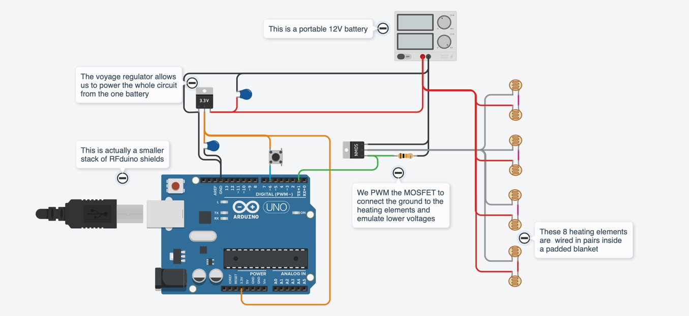

Battery Operated Warming Blanket
================================

A prototype portable warming blanket operated from a battery. Built to allow a wheelchair-bound
quadriplegic to control the temperature of his lower extremities while out in the New England
chilly seasons! I adapted this from a half-functioning design created by MIT undergraduates as
part of a assistive technologies hackathon.

Circuit Diagram
---------------

[See the full drawing on TinkerCAD](https://www.tinkercad.com/things/05tBPTAC0bf-warming-blanket).

Parts List
----------

* RFD22102 RFduino DIP - Arduino controller (I found it in my drawer of random Arduino stuff)
([datasheet on Sparkfun](https://cdn.sparkfun.com/datasheets/Dev/RFduino/rfduino.datasheet.pdf))
* RFD22122 RGB LED / Button Shield - LED output ([datasheet on Sparkfun](https://cdn.sparkfun.com/datasheets/Dev/RFduino/rfduino.datasheet.pdf))
* RFD22121 USB Shield - adapter for programming ([datasheet on Sparkfun](https://cdn.sparkfun.com/datasheets/Dev/RFduino/rfduino.datasheet.pdf))
* LM2937ET-3.3 - voltage regulator to get from the 12V battery down to the 3.3 needed by the Arduino
([datasheet from TI]((https://www.ti.com/lit/ds/symlink/lm2937.pdf?HQS=dis-dk-null-digikeymode-dsf-pf-null-wwe&ts=1635103661151)))
* MOSFET - transistor used as a switch to control the voltage level going from the battery to
the blanket
* 10k resistor - wired from the Gate to the Source on the MOSFET (as recommended by the spec sheet)
* 10uF capacitor - wired from the voltage regulator output to ground (as recommended by the spec sheet)
* 0.1uF capacitor - wired from the voltage regulator input to ground (as recommended by the spec sheet)
* push-button switch switch - a random one I found in my drawer that he could activate despite his limited
hand mobility
* electric heating pad - 8 of these are inside the blanket; they create heat correspondin to the input voltage ([on Adafruit](https://www.adafruit.com/product/1481))

Credits
-------

Created by Rahul Bhargava and Alex Rosenberg.
